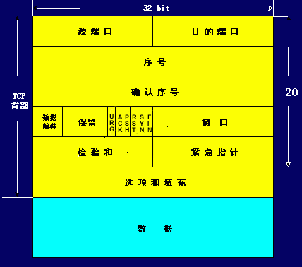
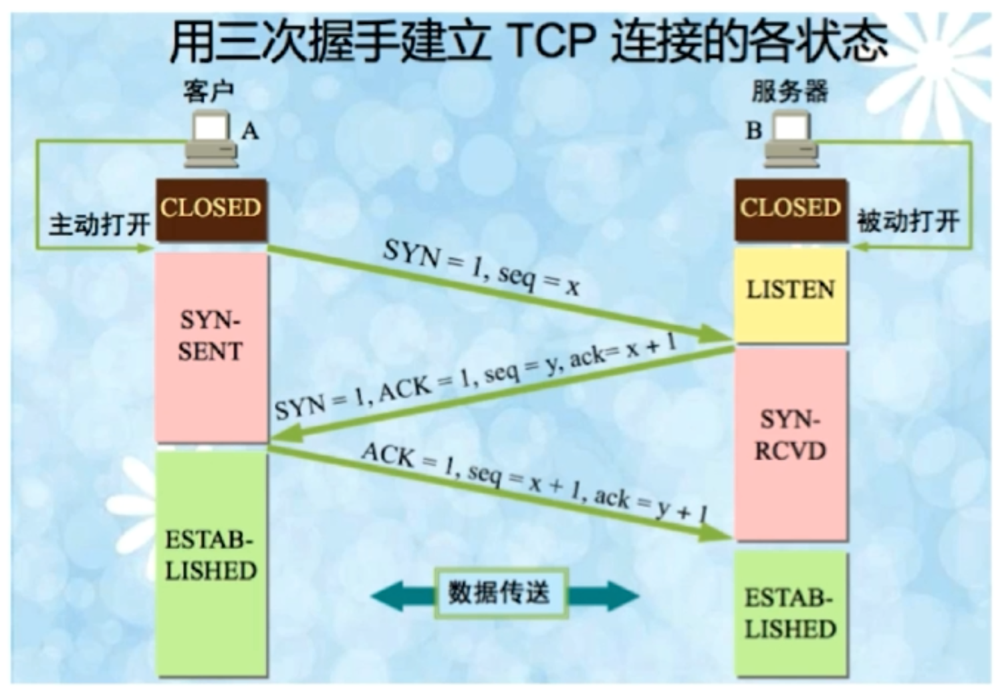

## TCP简介

+ 面向连接的、可靠的、基于字节流的传输层通讯协议
+ 将应用层的数据流分割成报文段并发送给目标节点的TCP层
+ 数据包有序号，对方收到则发送ACK确认，未收到则重传
+ 使用奇偶校验和来校验数据在传输过程中是否有误，在发送和接收同时都要校验

---

## TCP报文头

SourcePort(源端口)：16位的源端口中包含初始化通信的端口。

Destination(目的端口)：16位的目的端口，要传给哪个上层协议或应用程序。

**源端口和目的端口都不包含IP地址信息。IP地址用来标记主机，传输层使用协议端口号标记主机中的一个进程。IP地址+协议+端口号标记网络中的一个进程，在一些场合，这个也被称为套接字（socket）。**

sequence Number(序号)：4个字节，由接收端计算机使用，重新分段的报文成最初形式。当SYN出现，序列码实际上是初始序列码（Initial Sequence Number，ISN），而第一个数据字节是ISN+1。这个序列号（序列码）可用来补偿传输中的不一致。

确认序号：4个字节，是期望收到对方下一个报文段的第一个数据字节的序号。豆豆收到洛洛发送的报文，其序列号字段是301，数据长度是200字节，这表明了豆豆正确收到了洛洛发送的到序号500的数据， 因此豆豆期望收到的下一个报文序号是501，因此豆豆发送给洛洛的ack确认号为501。

数据偏移：4位。指出TCP报文段的数据起始处距离报文段的起始处有多远。这个字段实际上是指出TCP报文段的首部长度。由于首部中还有长度不确定的选项字段，因此数据偏移字段是必要的。

保留域：6位值域，这些位必须是0。为了将来定义新的用途而保留。

TCP Flags：

+ URG：紧急指针标记，当URG为1时，表明紧急指针字段有效。它告诉系统此报文段中有紧急数据，应尽快传送（相当于高优先级的数据），而不要按原来的排队顺序来传送。
+ ACK：确认序号标记。当ACK=1时确认号字段才有效。当ACK=0时，确认号无效。TCP规定，在连接建立后所有的传送的报文段都必须把ACK置1。
+ PSH：push标志。当两个应用进程进行交互式的通信时，有时在一端的应用进程希望在键入一个命令后立即就能收到对方的响应。发送方TCP把PSH置1，并立即创建一个报文段发送出去。接收方TCP收到PSH=1的报文段，就尽快地交付接收应用进程，而不再等到整个缓存都填满了后向上交付。
+ RST：重置连接标记。用来重置由于主机崩溃或者其他原因导致的错误连接，还用来拒绝一个非法的报文段或非法请求。
+ SYN：同步序号，在连接建立时用来同步序号。当SYN=1而ACK=0时，表明这是一个连接请求报文段。对方若同意建立连接，则应在相应的报文段中使用SYN=1和ACK=1。
+ FIN：finish标志，用于释放连接。当FIN=1时，表明此报文段的发送方的数据已发送完毕，并要求释放运输连接。

窗口：2字节。窗口值告诉对方： 从本报文段首部中的确认号算起，接收方目前允许对方发送的数据量。之所以要有这个限制，是因为接收方的数据缓存空间是有限的。总之，窗口值作为接收方让发送方设置其发送窗口的依据。并且窗口值是经常在动态变化着。

检验和：2字节。检验范围包括首部和数据两部分。

紧急指针：2字节。紧急指针仅在URG=1时才有意义，它指出本报文段中的紧急数据的字节数（紧急数据结束后就是普通数据）。

选项：长度可变，最长可达40字节。定义一些可选参数。当没有使用“选项”时，TCP的首部长度是20字节。

---

## 三次握手

