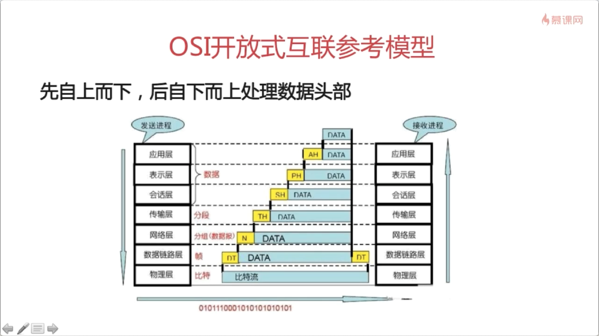

## 网络七层协议

### 物理层

两台物理机之间如何通讯？

机器A往机器B发送比特流，机器B能接收，这就是物理层要实现的。

物理层主要定义物理设备的标准，网线的类型、光纤的接口类型、各种传输介质的传输速率等。它的主要作用是传输比特流(就是由1、0转化为电流强弱来进行传输，到达目的地后在转化为1、0，也就是我们常说的数模转换与模数转换)。这一层的数据叫做比特。网卡就是工作在这一层的。

### 数据链路层

传输过程中会出现错传，传输不完整等可能性，如何保证比特流的正确性？

这一层定义了如何格式化数据进行传输，如何控制对物理介质的访问，这一层还提供错误检测与纠正，以确保数据传输的可靠性。本层将比特数据组成了帧。其中交换机工作在这一层里面。对帧解码，根据帧中包含的信息，把数据发送到正确的接收方。

### 网络层

随着网络节点的增加，点对点通讯的时候需要经过多个节点，如何找到目标节点？如何选择最佳路径？

这一层将网络地址翻译为对应的物理地址，并决定如何将数据从发送方路由到接收方。网络层通过综合考虑发送优先权，服务质量等来确定从一个网络中节点A到节点B的最佳路径。由路由器工作在这一层里面。这一层的数据我们称之为数据包。本层关注的协议为IP协议。

### 传输层

随着网络需求的进一步扩大，通讯过程中需要发送大量的数据，海量文件传输的，可能需要很长时间，网络在通讯的过程中会中断好多次，为了保证传输大量文件时的准确性，需要对发出去的数据进行拆分，切割为一个一个的段落进行发送，其中一个段落丢失了，该怎么办？要不要重传？每个段落要按照顺序到达吗？

传输层解决了主机之间的数据传输，数据之间的传输可以是不同网络的，并且解决了传输质量的问题。该层是OSI模型中最重要的一层， 传输协议同时进行流量控制，或是基于接收方接收数据的快慢程度，规定适当的发送数据。除此之外，传输层根据网络能处理的最大尺寸，将较长的数据包进行强制分割，将数据分为较小的数据片，同时给每个数据片安排一个序列号，以便数据到达接收方时，能以正确的顺序进行重组，该过程成为排序。本层需要关注的协议为TCP、UDP协议等。

### 会话层

现在我们已经保证给正确的计算机，发送正确的封装过后的信息了。但是用户级别的体验好不好？难道我每次都要调用TCP去打包，然后调用IP协议去找路由，自己去发？当然不行，所以我们要建立一个自动收发包，自动寻址的功能。

这时候会话层出来了，会话层的作用就是建立和管理应用程序之间的通讯。不同机器上的用户之间建立及管理会话。

### 表示层

现在我能保证应用程序自动收发包和寻址了。但是我要用Linux给window发包，两个系统语法不一致，就像安装包一样，exe是不能在linux下用的，shell在window下也是不能直接运行的。

这时候表示层上场了，帮我们解决不同系统之间的通信语法问题。在表示层，数据按照网络能理解的方案进行格式化，这种格式化，也因为使用网络格式的不同而不同。

### 应用层

虽然发送方知道自己发送的是什么东西，但接收方肯定不知道，所以应用层的协议诞生了。

应用层规定发送方和接收方必须使用一个固定长度的消息头，消息头必须使用某种固定的组成，而且消息头里必须记录消息体的长度等一系列信息，以方便接收方正确的解析发送方发送的数据。应用层让你更方便的应用接收到的数据，数据的传递，没有这一层的存在也可以完成。这一层需要关注的是HTTP协议。

---

## TCP/IP

OSI模型只是一个概念型标准，它的实现：TCP/IP

从字面意义上讲，有人可能会认为 TCP/IP 是指 TCP 和 IP 两种协议。实际生活当中有时也确实就是指这两种协议。然而在很多情况下，它只是利用 IP 进行通信时所必须用到的协议群的统称。具体来说，IP 或 ICMP、TCP 或 UDP、TELNET 或 FTP、以及 HTTP 等都属于 TCP/IP 协议。