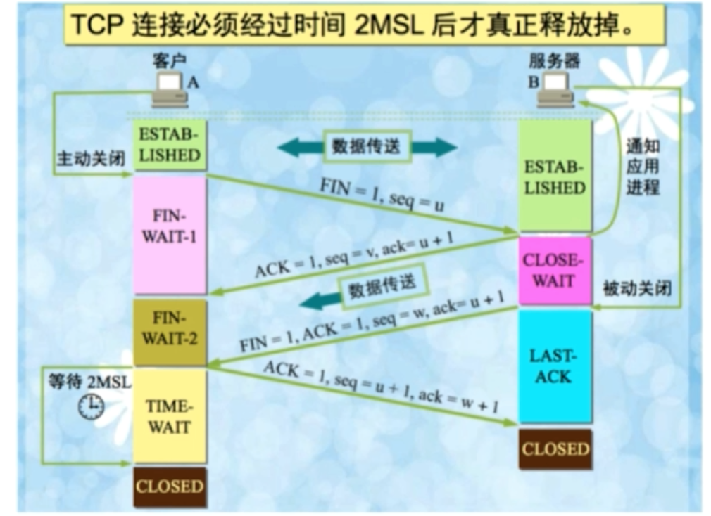

“挥手”是为了终止连接，这个可以由客户端或者服务端发起，假设由客户端发起，则TCP四次挥手的流程图如下：

**第一次挥手：**Client发送一个FIN，用来关闭Client到Server的数据传送，Client进入FIN_WAIT_1状态；

**第二次挥手：**Server收到FIN后，发送ACK给Client，确认序号为收到序号+1（与SYN相同，一个FIN占用一个序号），Server进入CLOSE_WAIT状态；

**第三次挥手：**Server发送一个FIN，用来关闭Server到Client的数据传送，Server进入LAST_ACK状态；

**第四次挥手：**Client收到FIN后，Client进入TIME_WAIT状态，接着发送一个ACK给Server，确认序号为收到序号+1，Server进入CLOSED状态，完成四次挥手。

---

### 为什么会有TIME_WAIT状态？

+ 确保有足够的时间让对方收到ACK包，可靠地终止TCP连接。
+ 避免新旧连接混淆，当一个TCP连接出于TIME_WAIT状态时，我们将无法立即使用该连接占用的端口来创建一个新的连接。譬如一些路由器会缓存IP数据包，如果被立即使用了，新的连接可能接收到属于原来的那个连接的、携带应用程序数据的TCP报文段，显然这是一个已经失去意义的报文段，这种事情不应该发生。

### 为什么需要四次挥手才能断开连接？

因为全双工，发送方和接收方都需要FIN报文和ACK报文，发送方和接收方各只需两次挥手即可，只不过有一方是被动地，所以看上去是四次挥手。

### 服务器出现大量CLOSE_WAIT状态的原因

表现为客户端一直在请求，返回客户端的信息是异常的，服务端根本没有收到请求。对方关闭socker连接，我方忙于读或写，没有及时关闭连接。

+ 检查代码，特别是释放资源的代码
+ 检查配置，特别是处理请求的线程配置