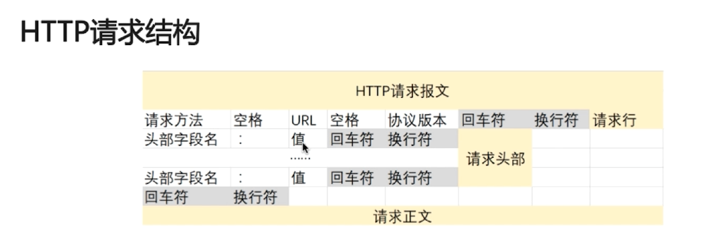
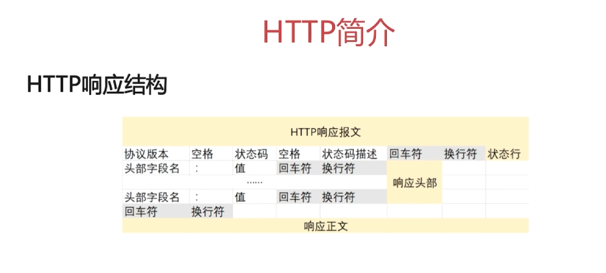

## 超文本传输协议HTTP主要特点

+ 支出客户/服务端模式
+ 简单快速，客户端向服务器请求服务时，只需传送请求方法和路径
+ 灵活，HTTP允许传输任意类型的数据对象
+ 无连接，限制每次连接只处理一个请求，服务器处理完客户的请求并收到客户的应答以后，即断开连接。
+ 无状态，协议对于事务处理没有记忆能力。

***

## 请求/响应的步骤

1. **客户端连接到web服务器**，一个HTTP客户端，通常是浏览器，与web服务器的HTTP的端口建立一个tcp套接字连接
2. **发送HTTP请求**，通过tcp套接字，客户端向服务器发送一个文本的请求报文
3. **服务器接受请求并返回HTTP响应**，web服务器解析该请求，定位请求资源，服务器将资源副本写到tcp套接字，由客户端读取
4. **释放tcp连接**，如果连接模式为close，则服务器主动关闭tcp连接，客户端被动关闭连接，释放tcp连接；如果连接模式为keepalive，则该连接会保持一段时间，在该时间内可以继续接收请求
5. **客户端浏览器解析HTML内容**，解析状态行，查看请求是否成功，然后解析每一个响应头
***

## 面试题

### 在浏览器地址栏键入URL，按下回车以后经历的流程

1. **DNS解析**，浏览器依据url逐层查询DNS服务器缓存，解析url中的域名对应的ip地址，DNS缓存从近到远依次为：浏览器缓存、系统缓存、路由器缓存、ips服务器缓存、域名服务器缓存、顶级域名服务器缓存。
2. **TCP连接**，找到IP地址之后，根据IP地址和对应端口，和服务器建立tcp连接。
3. **发送HTTP请求**，浏览器会发送读取文件的请求，该请求将发送给服务器。
4. **服务器处理请求并返回HTTP报文**
5. **浏览器解析渲染页面**
6. **连接结束**

### HTTP状态码

**五种可能的取值：**

1xx：指示信息——表示请求已接收，继续处理

2xx：成功——表示请求已被成功接收、理解、接受

3xx：重定向——要完成请求必须进行更进一步的操作

4xx：客户端错误——请求有语法错误或请求无法实现

5xx：服务器错误——服务器未能实现合法的请求

**常见状态码**

200 OK：正常返回信息

400 Bad Request：客户端请求有语法错误，不能被服务器所理解

401 Unauthorized：请求未经授权，这个状态代码必须和WWW-Authenticate报头域一起使用

403 Forbidden：服务器收到请求，但是拒绝提供服务

404 Not Found：请求资源不存在，例如，输入了错误的URL

500 Internal Server Error：服务器发生不可预期的错误

503 Server Unavailable：服务器当前不能处理客户端的请求，一段时间后可能恢复正常

### GET请求和POST请求的区别

**从三个层面来解答**

1. **Http报文层面：GET将请求信息放在URL**，请求信息和URL之用以`?`隔开，请求信息格式为键值对，对URL长度有限制，**POST放在报文体中**，想获得报文信息必须解析报文，因此安全性较GET形式高一些
2. **数据库层面：GET符合幂等性和安全性，POST不符合**，幂等性就是对数据库的一次操作和多次操作的结果是一致的。安全性是表示没有改变数据库原来的数据，GET请求一般做查询操作，大致符合安全性。
3. **其他层面：GET可以被缓存、被存储，而POST不行**

### Cookie和Session的区别

